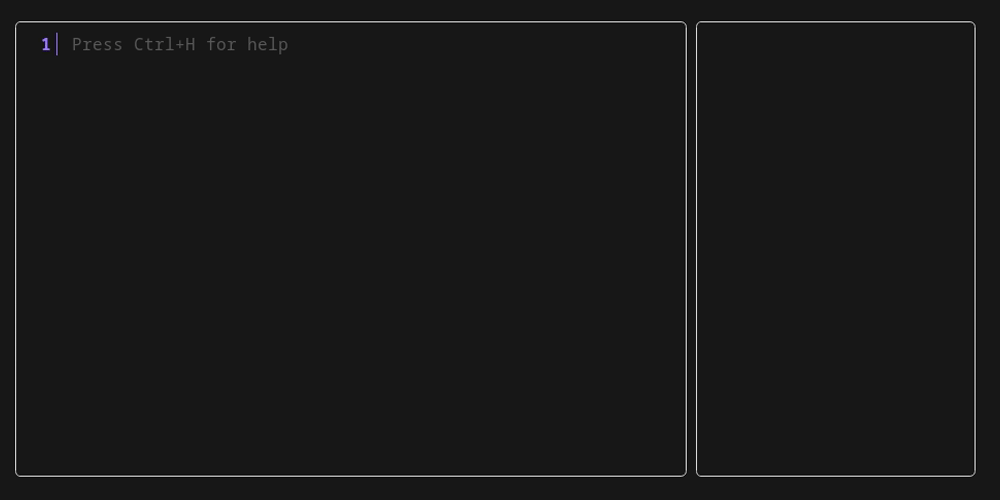

```
  _   _        _____  _____ 
 | \ | |      / ____|/ ____|
 |  \| | __ _| (___ | |     
 | . ` |/ _` |\___ \| |     
 | |\  | (_| |____) | |____ 
 |_| \_|\__,_|_____/ \_____|

```               
<h3>🧮 Do maths like a normal person 🧮</h3>




[](https://github.com/parnoldx/nascTUI/releases)
[](https://opensource.org/licenses/MIT)

## 
NaSC is an app where you do maths like a normal person. It lets you type whatever you want and smartly figures out what is math and spits out an answer on the right pane. Then you can plug those answers in to future equations and if that answer changes, so does the equations it's used in.

**Features:**
- 🧮 Advanced mathematical expressions and functions
- 🔄 Real-time unit conversions
- 📊 Multiple input lines with persistent history
- ⚡ Instant calculation results
- 🎨 Beautiful terminal UI
- 🔍 Auto-completion for functions and variables
- ↩️ Undo/redo functionality
- 🚀 Fast and lightweight

## Installation

#### Linux
```bash
bash -c "$(curl -sLo- https://raw.githubusercontent.com/parnoldx/nascTUI/refs/heads/master/install.sh)"
```

## Usage

Simply run the calculator:
```bash
nasc
```

## Dependencies

- [libqalculate](https://qalculate.github.io/) - Mathematical calculation engine
- [Bubble Tea](https://github.com/charmbracelet/bubbletea) - Terminal UI framework
- [Lipgloss](https://github.com/charmbracelet/lipgloss) - Styling and layout

## Contributing

Please feel free to submit a Pull Request. For major changes, please open an issue first to discuss what you would like to change.

## License

This project is licensed under the MIT License - see the [LICENSE](LICENSE) file for details.

---
