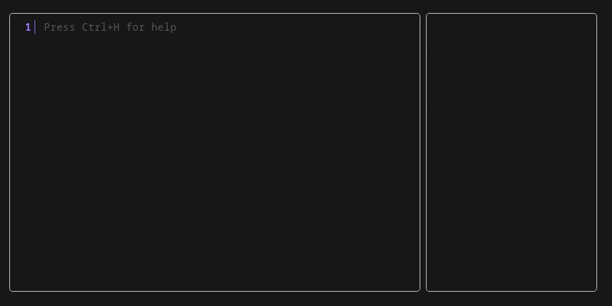

```
  _   _        _____  _____ 
 | \ | |      / ____|/ ____|
 |  \| | __ _| (___ | |     
 | . ` |/ _` |\___ \| |     
 | |\  | (_| |____) | |____ 
 |_| \_|\__,_|_____/ \_____|

```               
<h3>🧮 Do maths like a normal person 🧮</h3>




[](https://github.com/parnoldx/nascTUI/releases)
[](https://www.gnu.org/licenses/gpl-2.0)
[](https://github.com/Qalculate/libqalculate)

## 
NaSC is an app where you do maths like a normal person. It lets you type whatever you want and smartly figures out what is math and spits out an answer on the right pane. Then you can plug those answers in to future equations and if that answer changes, so does the equations it's used in.

**Features:**
- 🧮 Advanced mathematical expressions and functions
- 🔄 Real-time unit conversions
- 📊 Multiple input lines with persistent history
- ⚡ Instant calculation results
- 🎨 Beautiful terminal UI
- 🔍 Auto-completion for functions and variables
- ↩️ Undo/redo functionality
- 🚀 Fast and lightweight

## Installation

Works on Arch Linux, Omarchy, and other Arch derivatives, plus Debian/Ubuntu, Fedora, and openSUSE.

```bash
bash -c "$(curl -sLo- https://raw.githubusercontent.com/parnoldx/nascTUI/refs/heads/master/install.sh)"
```

Or from a checkout:

```bash
git clone https://github.com/parnoldx/nascTUI.git
cd nascTUI
./install.sh
```

Arch / Omarchy / AUR:

```bash
# official extra packages used at runtime / build time
omarchy pkg add libqalculate go   # or: sudo pacman -S --needed libqalculate go

# AUR package
yay -S nasc-tui
```

## Usage

Simply run the calculator:
```bash
nasc
```

## Contributing

Please feel free to submit a Pull Request. For major changes, open an issue first to discuss it.

## License

This project is licensed under the GPL v2 License - see the [LICENSE](LICENSE) file for details.

---
